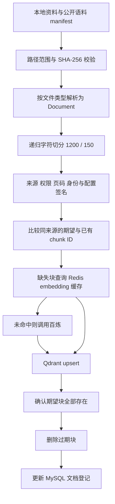

# 文档分块与入库链路详解：源码核对与面试回答

> 后续实现更新（2026-09-26）：[Harness 落地与路由回归验证](09-Harness落地与路由回归验证.md) 已完成在线分块修复、版本发布事务、结构化路由、按需工具和执行预算，并提供默认关闭的 Jev 适配器。本文保留当时的分析与测试快照；其中旧问题状态、全量工具装载和测试数量以新实现报告为准。

> 核对日期：2026-09-25。依据当前源码、配置和已保存的语料导入报告。本文区分实际批量入库路径、在线上传路径、可选算法和待实现方案；本次分析没有重新入库，也没有修改业务代码。

## 1. 先明确当前项目到底用了什么

当前部署配置为 MySQL + Qdrant + Redis，embedding 使用百炼 `text-embedding-v2`，知识集合为 `lab_knowledge_qwen_v1`，重排使用本地 `BAAI/bge-reranker-v2-m3`。

此前保存的 `.run/corpus-qwen.json` 报告记录了 **338 份源文件、1545 个 chunk、1,501,380 个 chunk 字符**。字符总数包含重叠，不等于原文去重后的字符数；这些是导入报告快照，不是本文重新测量的在线统计。

最重要的源码结论：

| 路径 | 实际处理方式 | 能否代表上述语料的分块策略 |
|---|---|---|
| `scripts/sync_knowledge_corpus.py` | 解析后调用递归字符分块，1200 字符、150 字符重叠 | **能，这是批量语料的实际入口** |
| 文件上传 API → `IngestionWorker` | 任务持久化后调用 `get_chunker().chunk(...)` | 当前接口不匹配，不能称为已跑通 |
| `DocumentLoaderManager.split_documents()` | 可选择 token 递归、标题、语义、混合等策略 | 属于可选能力；批量脚本未调用此方法 |
| 文本添加 `KnowledgeService.add_document()` | 整段文本包装成一个 `Document` 后直接向量化 | 不自动走上述分块器 |
| 旧同步文件方法 `add_document_from_file()` | `load_file()` 后直接写向量库 | 解析单元不等于经过长度控制的 chunk |

`worker.py` 和 `document_processor.py` 引用了 `get_chunker`，但 `chunker.py` 没有定义这个工厂；已有类暴露的是 `split_documents()`，也不是 worker 调用的 `chunk()`。因此，不能因为配置默认写着 `hybrid`，就说当前 1545 个 chunk 都经过了语义分块。

## 2. 一分钟面试回答

> 我的项目把入库分成解析、分块、元数据和身份生成、向量化、持久化几个阶段。当前几百份语料走批量同步脚本，PDF 先按页提取文本，Markdown、TXT 等按对应 loader 解析，再通过递归字符分块器优先沿段落、换行和中文标点切分，目标上限是 1200 字符，重叠参数是 150 字符。
>
> 每个 chunk 保留来源、标题、页码和权限等元数据，通过百炼 embedding 生成向量，写进 Qdrant；MySQL 保存文档登记和业务状态，Redis 缓存 embedding 和重排计算。增量同步比较同一来源的 chunk ID 集合，先补写并验证新块，再删除过期块，减少更新失败导致旧知识不可用的风险。
>
> 我也核对了实现边界：目前不是跨库原子事务，在线上传的分块接口还有不匹配问题；语义分块属于待验证的可选路线。下一步应统一入库接口，通过固定问题集比较切块参数，并用 LangSmith 或 Langfuse 追踪各阶段耗时和失败原因。

不要把待修复问题说成已解决；面试时如果没有亲自完成某项验证，应说“源码分析发现”或“计划验证”。

## 3. 文件、Document、chunk、向量点的区别

| 对象 | 含义 | 举例 |
|---|---|---|
| 源文件 | 磁盘上的原始资料 | 一份 20 页 PDF |
| 解析后的 `Document` | `page_content` 加 `metadata` 的内存对象 | PDF loader 通常每页一个 |
| chunk | 为检索与模型输入切出的文本单元，类型仍是 `Document` | 一页进一步拆成几个块 |
| Qdrant point | 向量、点 ID 和 payload | 一个 chunk 通常对应一个点 |
| MySQL 文档登记 | 业务目录中的逻辑资料 | 记录标题、状态、文件哈希和块数 |

338 份文件与 1545 个 chunk 是两种计数。平均每份约 4.57 块不能代表每份文件都差不多大，PDF 与短手册的分布可能相差很大。

## 4. 批量入库：从磁盘到可检索知识



### 4.1 枚举与来源校验

`build_documents()` 读取 `data/knowledge`。普通目录由 `iter_knowledge_files()` 枚举，跳过 `dicts`、`archive`、`licenses`、`upstream` 等目录；公开资料以 `public/*/manifest.json` 为准，校验文件位于知识目录内，并核对原始字节的 SHA-256。

公开手册附带 `source_url`、`repository`、`revision`、`source_kind`、`topic`、`license_path`。这既支持追溯，也防止资料被修改后继续冒充原来的上游版本。

当前实现先将全部文件解析、分块并保存在内存，再进入写库阶段。优点是发现空文本或校验失败时不开始本轮写库；代价是大规模语料时内存随总量增长，并非流式导入。

### 4.2 解析具体做什么

| 类型 | 当前 loader 行为 | 边界 |
|---|---|---|
| PDF | `PyPDFLoader` 按页提取，补充 `page_number`、`total_pages` 等 | 这条路径未接入 OCR；扫描件可能没有可用文本 |
| DOCX | `Docx2txtLoader` 提取文本 | 不能据此宣称完整保留表格、版式和图片 |
| TXT | 按 UTF-8 读取 | 编码异常需要额外处理 |
| Markdown | 文本读取并提取部分标题信息到元数据 | `load_file()` 本身不等于按标题树切块 |

loader 还支持其他类型，但不能把所有 loader 能力都当作上传接口白名单。当前文件上传接口支持 PDF、DOCX、Markdown 和 TXT。

PDF 页码有两套表示：基础 loader 的 `page` 通常从 0 开始，项目补充的 `page_number` 从 1 开始。展示与引用需要统一使用约定。

### 4.3 1200 / 150 到底是什么意思

实际代码来自 `reingest_lab_knowledge.py::build_splitter()`：

```python
RecursiveCharacterTextSplitter(
    chunk_size=1200,
    chunk_overlap=150,
    separators=["\n\n", "\n", "。", "；", " ", ""],
)
```

这里按 Python 字符长度衡量，**不是 1200 token，也不是 1200 字节**。算法优先保留大边界；段落过大时继续尝试换行、标点、空格，最后才退化到字符。它不是简单地每隔 1050 个字符机械截取。

150 是重叠目标参数，实际相邻块重叠受可保留的分隔单元影响，可能小于它。不同解析 `Document` 独立切分，因此这条路径不会把 PDF 上一页末尾与下一页开头合成一个块。

示意上，可以把重叠理解为让块 B 带上块 A 的部分尾部，减少“概念在 A、限定条件在 B”造成的断裂。但重叠会增加存储、embedding 输入以及召回重复。`150 / 1200 = 12.5%` 只是配置比例，不是实测冗余率。

当前批量脚本没有自动把父标题拼入每个正文块，也没有表格结构识别、代码 AST 切分或父子块检索。标题元数据与“标题实际参与 embedding”是两件事。

### 4.4 元数据如何继承

解析时得到的页码等字段被保留；`enrich_docs()` 补充 `source`、`title`、`doc_type`、`category`、`visibility`、`confidentiality`、`chunk_index`；批量同步再加身份和上游来源信息。

下面是字段结构示意，省略真实路径与具体哈希：

```json
{
  "source": "<知识目录内文件的绝对路径>",
  "title": "ibv_reg_mr.3.txt",
  "doc_type": "reference_manual",
  "category": "public",
  "visibility": "public",
  "confidentiality": "public",
  "doc_id": "corpus-<source_id>",
  "source_id": "<相对路径 SHA-256 前 24 位>",
  "file_hash": "<原始文件 SHA-256>",
  "chunk_index": 0,
  "ingestion_signature": "split1200-overlap150-v1:qwen:text-embedding-v2",
  "chunk_id": "<规范化文本与元数据的 SHA-256>",
  "revision": "<公开资料的上游提交>"
}
```

`visibility=public` 与 `confidentiality=internal` 在普通资料中可以同时出现，不能只检查其中一个字段就认定允许向所有人展示。权限需要结合业务登记、当前用户和 ACL 规则判断。

## 5. 去重、身份和增量更新

### 5.1 几种 ID 不解决同一个问题

| 字段 | 批量脚本的生成方式 | 作用与限制 |
|---|---|---|
| `file_hash` | 原始文件字节 SHA-256 | 检测整个文件是否变化 |
| `source_id` | 知识目录相对路径 SHA-256 前 24 位 | 逻辑来源；改名或移目录会变化 |
| `doc_id` | MySQL 模式下 `corpus-` 加 source_id | 关联业务文档登记 |
| 外部 chunk ID | 文本、元数据、序号规范化 JSON 的 SHA-256 | 内容、权限、配置变化均可触发新 ID |
| Qdrant point ID | 外部 ID 经 UUID5 映射 | 适配 Qdrant ID 类型，支持确定性 upsert |

chunk ID 生成输入包含 `file_hash`、绝对来源路径和模型签名。因此整个文件改一个字节，即使部分块正文不变，它们的 ID 也可能全部改变；搬迁到另一个绝对目录也可能改变 ID。这是版本敏感的确定性身份，不是内容定义切块，也不是纯正文跨文件去重。

在线 worker 的 ID 规则不同：`file_hash[:20] + index + MD5(正文 + file_hash + index)[:12]`。这里 MD5 用作短身份摘要，不能当作安全校验保证；两条入口尚未统一身份规范。

### 5.2 批量同步的真实顺序

1. 按 `source` 读取已有 ID，与本轮期望 ID 集合比较。
2. 完全一致时跳过向量写入，但仍更新 MySQL 登记信息。
3. 不一致时，只处理缺失 ID，每组最多 50 个调用向量管理器。
4. embedding 层检查 Redis；未命中文本交给百炼，默认每批 10 条。
5. Qdrant 适配器再按最多 64 个点一组 upsert，并等待写入完成。
6. 重新读取该来源 ID，检查所有期望 ID 都已存在。
7. 删除 `previous - expected`，最后登记文档标题、块数与文件信息。

50、10、64 分属脚本、模型 API、存储适配器，不能混为同一个 batch size。

失败前已写入的新块可以在下一次同步中复用；旧块在验证新块存在前保留。但新旧块可能短暂并存，MySQL 更新也可能失败，所以这是可重试的分阶段同步，**不是跨 MySQL/Qdrant 的原子事务**。本地文件从清单消失时，脚本不会自动删除远端资料。

## 6. MySQL、Qdrant、Redis 分别保存什么

| 位置 | 当前职责 | 不应混淆的边界 |
|---|---|---|
| 文件系统 | 原文件、上传资料、公开语料清单 | 上传持久化到 `data/uploads` |
| MySQL | 文档登记、任务状态、版本及其他业务数据 | 不是当前向量检索引擎 |
| Qdrant | chunk 向量及 `text / metadata / external_id` payload | 当前使用余弦距离配置 |
| Redis | embedding 数组、重排序号/分数缓存 | 当前不承担入库任务队列，也不是最终回答缓存 |
| 应用内存 | BM25 索引和检索快照 | 当前不是 Qdrant 原生 sparse 检索 |

百炼 embedding 缓存键包含模型、用途和完整输入文本的摘要。即使文件版本变化导致 chunk ID 更新，只要正文与模型等缓存身份不变，仍可能命中缓存。默认 embedding TTL 为 604800 秒，重排为 600 秒。

Redis 故障时回源计算，连接/读取超时为 0.3 秒，异常后短暂熔断 10 秒。缓存主要减少重复计算与外部调用，不能把“缓存命中更快”解释为“知识理解更准确”。

切换 embedding 模型需要匹配集合的向量维度和模型身份。当前 Qwen 集合与此前 BGE 集合分开，不能直接把不同向量空间的数据混写并比较距离。

## 7. 在线上传：已经实现什么，还缺什么

上传服务检查空文件、50 MB 上限、文件名和扩展名，计算原始内容 SHA-256；若最近同哈希任务处于 pending/running/retrying/completed，则返回重复结果。否则保存文件并创建 MySQL 任务。

任务状态为 `pending → running → completed`；失败后进入 `retrying`，达到限制进入 `failed`。MySQL 领取使用事务与 `FOR UPDATE SKIP LOCKED`，减少多个 worker 重复领取同一待处理行；启动时可以恢复超时 running 任务。

但“行锁领取成功”不等于 exactly-once：进程可能在写 Qdrant 后、标记 completed 前退出，必须依靠确定性 ID 和可重试操作承受重复执行。

| 核对到的问题 | 影响 | 建议修复方向（尚未实施） |
|---|---|---|
| worker / DocumentProcessor 导入不存在的 `get_chunker`，调用接口也不匹配 | 真实文件处理会卡在分块调用之前 | 统一调用 loader 的 `split_documents()` 或建立真实工厂，并做一次完整上传验证 |
| worker 在 embedding 前调用 `archive_and_replace()` | 后续向量化失败时，版本状态可能已经改变 | 引入 preparing 状态，验证新块后再发布版本 |
| 合并元数据仅填补缺失字段，loader 的 `source` 可能覆盖业务来源约定 | 查旧块用文件名、写新块用持久化路径时无法正确替换 | 统一稳定 source_id，单独保留展示名与物理路径 |
| 上传去重按全局文件哈希查询 | 相同内容、不同权限或归属可能被当作同一次入库 | 把业务作用域纳入去重与授权校验 |
| worker 缺少与批量脚本相同的文档登记步骤 | 不能从任务 completed 推断目录与 ACL 登记完整 | 统一登记和发布流程 |
| 空解析结果在存储方法中可返回 0 | 可能形成零块“成功”任务 | 明确零文本错误与 OCR 分流 |

现有 `test_ingestion_pipeline.py` 中有将 `_load_and_chunk` 替换为 `MagicMock` 的测试，所以这类测试通过不能证明真实解析、分块和向量化链路正常。这里需要覆盖接口契约和真实小文件的集成验证。

## 8. 源码中的 token、semantic、hybrid 算法如何回答

### 8.1 Token 递归

`TokenRecursiveSplitter` 通过 token 估算控制长度，优先按结构分隔，支持标题和邻句补充。主要使用 `tiktoken` 的 `cl100k_base`；缺少编码器时使用字符估算，因此不应称为百炼 tokenizer 的精确计数。

配置默认 `chunk_token_size=500`、`chunk_token_overlap=100`。但邻句重叠实际还依赖句数和预算判断，不能承诺相邻块恰好重叠 100 token。补充标题或邻句后也不能直接承诺最终长度严格不超过 500。

### 8.2 语义分块

核心思想是对句子生成向量，计算相邻句差异：

```text
change(i) = 1 - cosine(sentence_vector[i], sentence_vector[i+1])
当 change(i) > threshold 时，把这里作为候选语义边界。
```

然后结合长度约束合并短块、拆分长块，并补充邻句。按该判断式，**阈值越高越不容易切开**；配置描述里的“越高越敏感”与实现方向相反，应按代码解释。

语义切分需要额外计算句向量，最终写库还要计算 chunk 向量。它可能增加模型调用、耗时和成本，是否提高召回必须测量，不能只因名称更高级就替换。

### 8.3 混合分块

`HybridChunker` 大体顺序为：保护列表项 → 按 token 粗切 → 按句向量变化细调边界 → 合并短块 → 补邻句/标题 → 恢复列表内容 → 输出块与元数据。部分短文本走快捷返回，不执行全部阶段。

通过 loader 构造时，目标默认为 500 token，最小值是目标的三分之一，最大值是目标的两倍；直接实例化类的默认 min/max 又不同。面试必须说明调用入口，不应只背构造函数默认值。

当前实现有必须先解决的内容完整性问题：`_fine_tune_boundary()` 切成两部分后，仅追加 token 数大于 `min_tokens` 的部分，随后直接 `continue`。较短部分可能被丢弃，而不是留给后续合并。列表占位符、噪声过滤以及单个超长句也需要检查内容保留和长度边界。

因此，推荐先把字符分块作为可重复基线，修复可选算法，再比较质量和成本。不能把现有 Hybrid 实现直接包装成“无损、严格限长的生产语义分块”。

## 9. chunk 入库后怎样参与回答

用户问题生成查询向量，Qdrant 召回语义相近的块；BM25 从应用维护的文本索引召回关键词匹配块，经 RRF 融合、权限过滤和可配置重排后，候选内容再进入回答上下文与引用流程。

Qdrant 写入后会更新集合 revision 并使混合检索索引失效，以便刷新 BM25 快照。不能说“写了向量库，所有进程的关键词索引天然实时一致”。

分块过小容易丢掉定义、条件和证据上下文；过大容易稀释检索主题、挤占上下文并增加模型输入。重排只在已召回候选中排序，无法找回根本没有被切出或召回的证据。

## 10. 可以使用 LangSmith 等框架吗

可以。项目已依赖 LangChain 和 LangGraph，适合增加追踪与评估。它们解决的是“哪里慢、哪里错、修改后是否更好”，不直接替换分块器或向量数据库。**本次仅完成接入分析，未配置账户、未启用上传追踪、未部署新服务。**

| 工具 | 在本项目中的用途 | 当前环境下的选择 |
|---|---|---|
| LangSmith | LangGraph 执行轨迹、模型与工具调用、数据集实验对比 | 允许经代理访问云端时接入较直接；自托管属于 Enterprise 附加能力 |
| Langfuse | 追踪、模型用量与评估数据管理，支持自托管 | 更符合本地保存追踪的需求，但需要额外基础设施 |
| Ragas | context precision/recall、faithfulness 等 RAG 评估 | 适合作为离线评估补充，部分指标依赖评判模型 |

以上依据官方 [LangSmith 追踪文档](https://docs.langchain.com/langsmith/observability-quickstart)、[评估文档](https://docs.langchain.com/langsmith/evaluation-quickstart)、[自托管说明](https://docs.langchain.com/langsmith/self-hosted)、[Langfuse 自托管文档](https://langfuse.com/self-hosting)、[Ragas 指标说明](https://docs.ragas.io/en/stable/concepts/metrics/available_metrics/)。商业能力与部署依赖以接入时选定版本为准。

### 10.1 应该追踪哪些点

建议入库父 trace 关联 `job_id / source_id / file_hash / ingestion_signature`，各阶段记录计数、耗时和异常；内容默认使用摘要和 ID，避免把完整实验室资料直接发送到外部追踪平台。

```text
ingest
  parse          文件类型、页数、抽取字符数
  split          策略、配置、块数、长度分位数、正文覆盖检查
  embedding      模型、批次数、缓存命中数、重试次数、耗时
  qdrant_upsert  集合、预期/实际 ID 数、写入耗时
  publish        旧块清理、MySQL 登记、最终状态

query
  query_embedding → dense / BM25 → ACL → RRF → rerank → generation
```

设置 LangSmith 环境变量可以开启已有 LangChain/LangGraph 的集成追踪，但百炼原生 SDK、自定义 Redis 和 Qdrant 调用需要显式 `@traceable` 或 span。仅看到整张图的耗时，无法定位“模型慢还是缓存失效”。队列生产者与 worker 还需要显式传播关联信息，不能假设跨进程自动串起父子 trace。

成本指标应以模型返回的 usage 和可核对的计价为依据；本地模型、缓存命中以及自定义百炼调用不能自动套用其他提供商的价格。

### 10.2 代理和 Docker 的实际限制

LangSmith 云端模式需要账户、API key、匹配区域的 endpoint 和可达网络。`set_proxy` 通常只改变当前 shell，已经启动的后端、systemd 服务、Docker daemon 和容器不会自动继承；应分别验证实际发请求的进程。Docker 拉取镜像与应用上传 trace 是两条网络路径。

拟接入时可使用以下启动环境，值由部署环境提供，不把密钥写入文档：

```bash
export LANGSMITH_TRACING=true
export LANGSMITH_PROJECT=enterprise-knowledge-agent
# LANGSMITH_API_KEY 和 LANGSMITH_ENDPOINT 由部署环境注入
# 在真正启动后端的进程环境中配置 HTTP_PROXY / HTTPS_PROXY
# NO_PROXY 包含本地服务地址；容器内还应包含内部服务名称
```

LangSmith 自托管不是下载一个免费镜像就可用：官方说明需要 Enterprise 附加授权，且有 PostgreSQL、ClickHouse、Redis 等依赖。Langfuse 提供 [Docker Compose 方案](https://langfuse.com/self-hosting/deployment/docker-compose)，官方 [Compose 配置](https://github.com/langfuse/langfuse/blob/main/docker-compose.yml) 同样包含 PostgreSQL、ClickHouse、Redis、对象存储及应用服务；现有 MySQL/Qdrant/Redis 三件套不能直接替代全部依赖。

本次通过代理读取了 Langfuse 官方 Compose 文件，但没有拉取其全部镜像；因此尚不能宣称已验证部署成功。部署时应锁定版本与镜像 digest，验证镜像仓库可达性、资源占用、持久卷和内部连通性。即使追踪服务本地部署，使用百炼的 embedding/生成仍然需要对应网络。

### 10.3 如何证明 chunk 改动有收益

先修复上传接口与内容丢失问题，再固定语料版本、embedding、检索参数、重排器及问题集，对比：

| 实验 | 唯一主要变化 | 观察重点 |
|---|---|---|
| A | 现有字符 1200 / 150 | 建立可复现基线 |
| B | 不同字符长度与 overlap | Recall@k、MRR、重复证据与输入成本 |
| C | 按标题保留结构或标题入正文 | 章节归属和指代问题 |
| D | 修复后的 token / semantic / hybrid | 召回收益是否覆盖额外入库成本 |

评测样本应覆盖中文制度、英文手册、PDF 跨页问题、表格/代码、无答案和权限限制。检索评价优先采用人工标注的来源或证据区间；因为 chunk 策略变化会改变 ID，只用旧 chunk ID 作 gold label 会错误惩罚新策略。

记录 Recall@k、MRR、引用支持率、无答案拒答、ACL violation、P50/P95 耗时、缓存命中率和模型调用量。Ragas 的模型评判作为补充，并抽样人工复核；评判模型与业务模型都用百炼时，也要承认相关偏差和额外成本。

冷缓存与热缓存分别测量，本地重排模型预热状态固定。此前少量手选查询的命中和毫秒级重复查询结果，只能作为冒烟与缓存效果证据，不能当作大规模质量结论。

## 11. 常见面试追问

**为什么不直接把整篇文档生成一个向量？** 一篇可能包含多个主题，单向量容易稀释具体证据；整篇输入也占上下文。短文本可以整体入库，长文需要在主题完整性与检索粒度之间取舍。

**为什么选 1200 / 150？** 这是当前脚本的工程基线，兼顾长度与边界连续性；还没有充分消融证据证明它最优。应结合中英文、文档类型和问题集评估。

**修改 `.env` 的 CHUNK_SIZE 会重切当前语料吗？** 不会自动重切，而且当前批量 splitter 硬编码 1200 / 150；必须改实际调用路径并重新同步，记录新签名。

**标题在 metadata 里，模型就能理解章节了吗？** 不一定。当前 embedding 输入是正文，metadata 标题主要支持筛选、溯源与展示。若希望标题影响向量，需要显式拼接并重新评估。

**为什么不直接上语义分块？** 需要额外句向量计算，而且当前实现存在短片段可能丢失的问题。先保障内容完整，再用实验决定是否值得。

**换 Qdrant 会自动提高准确率吗？** 不能保证。Qdrant 改善存储、过滤和运行能力；分块、模型、召回参数、语料质量和评估才决定实际效果。

**Redis 是否缓存用户答案？** 当前不缓存最终答案，主要缓存 embedding 和重排计算。重排缓存结果需要作用于本次已授权候选，不能把其他用户的文档列表直接拿来复用。

**新文档失败时旧文档还在吗？** 批量同步在新块验证前不删旧块，但无法承诺整个更新原子可见；在线 worker 还有版本提前归档问题，两者必须区分。

**如何做到完全一致的版本切换？** 可以设计不可变版本、准备状态、验证清单，再通过业务 active_version 或集合别名发布；读路径必须遵守发布指针，失败后要有补偿与清理。这是改进方案，不是当前已具备的跨库事务。

**为什么测试通过还能有入库缺陷？** 部分测试 mock 了真实分块方法，只验证外围控制流。应补真实入口的契约测试、正文覆盖测试和小文件端到端测试。

**LangSmith 能自动优化 chunk 吗？** 它能提供轨迹和实验对比；具体切分策略仍需自己设计、验证和选择。仪表盘本身不代表召回提高。

## 12. 复核与代码阅读顺序

本次在 `agent-demo` 环境导入 `src.rag.processing.chunker`，确认 `hasattr(module, "get_chunker")` 为 `False`；已安装的 LangSmith SDK 版本为 `0.7.11`，但依赖存在不代表已经配置追踪。导入报告中的集合名、338 份文件和 1545 块也已读取核对。本次没有运行全量业务测试、真实上传或付费 embedding 调用，尚未验证的部署与质量收益不写成既成结论。

按以下顺序读源码，能把“参数在哪里定义”与“实际在哪里执行”对应起来：

1. [批量语料同步](../../scripts/sync_knowledge_corpus.py)：清单校验、身份、增量更新、登记顺序。
2. [实际字符 splitter](../../scripts/reingest_lab_knowledge.py)：1200 / 150、目录过滤、元数据补充。
3. [文档加载器](../../src/rag/processing/document_loader.py)：各类解析和可选分块入口。
4. [语义与混合分块](../../src/rag/processing/chunker.py)：候选边界、短块处理、实际公开接口。
5. [上传服务](../../src/api/services/knowledge_service.py)、[任务队列](../../src/rag/ingestion/job_queue.py)、[worker](../../src/rag/ingestion/worker.py)：在线入口与状态流转。
6. [embedding](../../src/models/embeddings.py)、[Redis 缓存](../../src/rag/cache.py)、[Qdrant 适配器](../../src/rag/storage/qdrant_store.py)：计算与持久化边界。
7. [混合检索](../../src/rag/retrieval/hybrid_retriever.py)、[检索管理器](../../src/rag/retrieval/retriever.py)：入库结果怎样成为证据。

如需仅验证语料计划，可以在已配置的 `agent-demo` 环境运行以下命令。它解析本地资料并写报告，不调用 embedding；可能触发本地依赖加载，并非零开销操作：

```bash
conda run -n agent-demo python scripts/sync_knowledge_corpus.py \
  --collection lab_knowledge_qwen_v1 --report .run/corpus-plan.json
```

真正写库需要另外加 `--apply` 并确保数据库凭据已配置。**务必显式传 `--collection`**：该脚本默认值仍是 `lab_knowledge_v2`，不能仅凭 `.env` 中的集合名推断写入目标。
