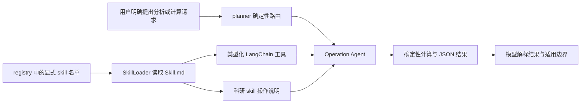

# 科研技能与工具扩展

> 后续实现更新（2026-09-26）：[Harness 落地与路由回归验证](09-Harness落地与路由回归验证.md) 已完成在线分块修复、版本发布事务、结构化路由、按需工具和执行预算，并提供默认关闭的 Jev 适配器。本文保留当时的分析与测试快照；其中旧问题状态、全量工具装载和测试数量以新实现报告为准。

> 更新：2026-09-26。本次新增 5 个运行时 skill、10 个离线工具。它们由项目 `SkillLoader` 加载，不是安装到开发者个人目录中的 Codex skill。

补充：后续已新增论文写作 skill 与 4 个工具，当前技能目录总数为 12。本文的 5 个/10 个与 11 个总数是该批次快照；新增写作能力见 [论文写作辅助设计与首版实现](07-论文写作辅助设计与首版实现.md)。

## 1. 新增能力与使用示例

| Skill | 工具 | 可以直接发给助手的请求 | 输出与边界 |
|---|---|---|---|
| `data_analysis` | `profile_csv` | “分析下面 CSV 的缺失值和重复行：…” | 行数、列类型、缺失数、重复行数、数值列均值/极值 |
| 同上 | `aggregate_csv` | “CSV 按 method 分组，汇总 latency_ms 的均值：…” | 按列分组的 mean/sum/min/max/count；空数值跳过并报告 |
| `unit_conversion` | `convert_units` | “单位换算：1 GiB 等于多少 MiB？” | 1024 MiB；明确区分十进制/二进制和 bit/byte |
| 同上 | `estimate_transfer_time` | “估算传输时间：1 GB，1 Gbps，有效效率 50%” | 理论 16 秒；并非实测吞吐或实际完成时间 |
| `text_analysis` | `compare_texts` | “对比两段文本：旧版…，新版…” | 逐行增删计数和 unified diff |
| 同上 | `markdown_outline` | “提取 Markdown 标题：…” | 标题层级、原始行号；忽略代码围栏里的标题 |
| `citation_check` | `extract_research_identifiers` | “提取 DOI 和 arXiv 编号：…” | 标识符与链接；只提取格式，不联网核验 |
| 同上 | `audit_citation_markers` | “检查引用编号，来源共 2 篇，回答是…[文档3]” | 报告越界、使用和未使用的编号；不判断语义支持 |
| `rag_evaluation` | `evaluate_retrieval` | “计算检索指标：召回 a,b,a，相关 b,c，k=3” | Precision=1/3、Recall=0.5、RR=0.5，重复 ID 不加分 |
| 同上 | `preview_chunks` | “预览分块效果，chunk_size=1200，overlap=150，正文…” | 字符长度、块数、前 5 块摘要；不调用 embedding、不写库 |

所有新工具只消费显式输入，不新增文件读取、数据库访问、网络请求或后台任务。若只给一个文件路径，这些工具不会自动读取它；需要通过既有授权读取流程取得正文，或直接粘贴内容。工具本身离线运行，助手理解请求和组织回答仍使用当前配置的模型服务。

原有 6 个 skill 保留，技能目录总数变为 11。新增 skill 的说明既可供 `SkillLoader.create_agent()` 单独使用，也进入主 Operation Agent 的提示词，避免只有工具名而没有使用规则。

## 2. 实际接入链路



主图的三类路由不变：工具操作、知识检索、普通对话。新增工具不增加隐藏的多 Agent 并行流程，也不绕过知识检索 ACL。概念问题如“chunk 是怎么做的”“实验室引用规范是什么”继续进入知识检索；“预览分块”“检查引用编号”等明确操作进入工具分支。

注册使用 [registry.py](../../src/agent/skills/registry.py) 的 `OPERATION_SKILLS` 显式名单，避免把新出现的任意目录自动授予主 Agent。新工具通过 [mcp_adapter.py](../../src/agent/tools/mcp_adapter.py) 中的统一工具收集函数进入主 Agent；它们本身不依赖 MCP 服务器。

Operation Agent 缓存键现在包含提示词、工具名、描述及参数 schema，避免两组工具数量相同就复用错误 Agent。问候路由改为完整问候匹配，防止 `shifting` 等包含 `hi` 的专业词被当成闲聊。

## 3. 输入与结果契约

工具参数由函数签名生成 LangChain schema。函数中的业务校验进一步限制数值、长度和口径；正常与业务错误都返回 JSON：

```json
{"ok": true, "value": 1024.0, "from_unit": "GiB", "to_unit": "MiB", "input": 1.0}
```

```json
{"ok": false, "error": "不能换算不同物理维度"}
```

JSON 字段缺失、类型不符合 schema 等属于调用参数验证错误；`ok=false` 是已经进入函数后发现的业务输入问题。Agent 应解释并请求正确输入，不能把错误对象当成完成结果。

| 工具类别 | 输入/输出上限 | 重要口径 |
|---|---|---|
| CSV | 40000 字符、1000 数据行、50 列、50 分组 | 列名唯一；count 计算非空有效数值个数；非法数值不当 0 |
| 文本 diff | 每版本 20000 字符、1000 行；diff 最多 12000 字符 | 行结束符差异不体现在行级增删中；截断显式标记 |
| 标题提取 | 40000 字符；最多展示 100 个标题 | 仅支持 ATX 标题，不承诺完整 Markdown 语法解析 |
| 标识符提取 | 40000 字符；每类最多展示 100 个 ID | DOI 为启发式格式提取；arXiv 仅支持新格式；真实有效性未验证 |
| 引用编号 | 来源数 0–1000 | 检查 `[文档N]`；来源全部用到并不是正确回答的必要条件 |
| 检索评估 | 每个 ID 列表最多 1000 项，每项 200 字符，k 为 1–1000 | Precision 分母固定 k；重复排名占位置但不重复命中 |
| 分块预览 | 40000 字符，chunk_size 为 20–8000 | overlap 必须小于 chunk_size；最多预览 5 块、每块 500 字符 |

无人工相关标注时，Recall 和 NDCG 返回 `null`，而不是报告 0 分；RR 是单查询倒数排名，多查询平均后才叫 MRR。工具不自动产生 gold label。

分块预览复用了实际语料脚本的分隔符顺序，默认 1200/150。它模拟单个文本解析单元，不会替代 PDF loader 的逐页解析。算法对比与真实入库的差别见 [文档分块与入库链路详解](05-文档分块与入库链路详解.md)。

## 4. 代码导航与扩展方法

新增目录均位于 `src/agent/skills/`：

- [data_analysis/Skill.md](../../src/agent/skills/data_analysis/Skill.md)：CSV 检查与分组汇总。
- [unit_conversion/Skill.md](../../src/agent/skills/unit_conversion/Skill.md)：单位与传输时间。
- [text_analysis/Skill.md](../../src/agent/skills/text_analysis/Skill.md)：文本版本与 Markdown 结构。
- [citation_check/Skill.md](../../src/agent/skills/citation_check/Skill.md)：参考标识符和引用编号。
- [rag_evaluation/Skill.md](../../src/agent/skills/rag_evaluation/Skill.md)：检索指标与字符分块预览。

每个目录包含 `Skill.md` 和 `scripts/tools.py`。公共输入校验与 JSON 返回位于 [_validation.py](../../src/agent/skills/_validation.py)。

继续扩展时：先定义明确场景和输入口径，在 `Skill.md` 的 YAML 中列出工具函数；实现有类型注解和说明的函数，再加入显式注册名单与必要的操作路由。凡需要访问知识库或业务数据的工具，应显式获得当前用户身份并复用 ACL，不可照搬这里的纯函数模式直接全库查询。

## 5. 验证与实际效果边界

[测试文件](../../tests/test_research_skills.py) 使用真实 `SkillLoader` 加载并通过 `tool.invoke()` 调用新工具，验证数值结果、CSV 引号与缺失值、异常输入、代码围栏、越界引用、重复召回、分块长度、注册链路、Agent 提示词和缓存行为；同时验证知识查询仍走检索分支。

定向验证命令：

```bash
conda run -n agent-demo python -m pytest \
  tests/test_research_skills.py tests/test_statistics_skill.py \
  tests/test_operation_agent.py tests/test_agent_architecture.py -q
```

本次定向结果为 **76 passed**；随后执行全量 `python -m pytest -q`，结果为 **439 passed、4 skipped**。这些测试证明工具计算和代码接入，未调用百炼进行真实对话，因此不将模型选工具成功率、最终回答质量或延迟提升写成已验证收益。部署时需要重启已有后端进程以加载新代码。

新增技能的价值是把可精确计算的任务交给工具，减少模型心算、编造统计结果以及混淆单位的机会；它们不自动修复此前发现的在线上传分块接口问题，也不等于已经部署 LangSmith。
