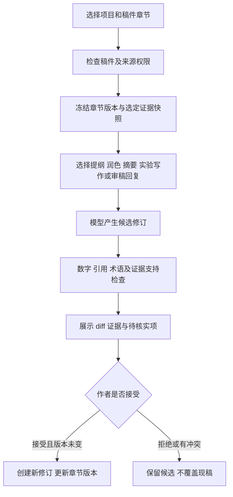

# 论文写作辅助：设计与首版实现

> 后续实现更新（2026-09-26）：[Harness 落地与路由回归验证](09-Harness落地与路由回归验证.md) 已完成在线分块修复、版本发布事务、结构化路由、按需工具和执行预算，并提供默认关闭的 Jev 适配器。本文保留当时的分析与测试快照；其中旧问题状态、全量工具装载和测试数量以新实现报告为准。

> 日期：2026-09-26。已落地的是聊天版 `paper_writing` skill 与 4 个本地工具；论文工作台、持久化稿件、自动证据绑定和导出属于下面明确标注的后续设计。本次未新增数据库表、页面或外部论文服务。

## 1. 产品目标

把用户已经掌握的研究问题、方法、实验数据和文献证据，组织成可修改、可核对的论文材料。围绕写作中的真实任务提供帮助：构思提纲、修改段落、描述实验、检查引用、回复审稿意见。

首版支持用户在聊天中提供材料并得到候选文本；第二阶段围绕项目保存稿件、章节、修订和证据。论文草稿与已发布知识必须分开，模型生成的句子不能自动回流成“已验证事实”。

## 2. 六类写作任务

| 任务 | 所需输入 | 期望产物 | 首版状态 |
|---|---|---|---|
| 提纲规划 | 研究问题、论文类型、拟议贡献 | 章节结构、写作目标、待补证据 | 已有骨架工具，模型可结合材料细化 |
| 中英文润色/翻译 | 原文、目标语言、术语约定 | 候选段落、必要的改动说明 | 已接入 skill 提示词与路由，模型执行改写 |
| 摘要与引言 | 问题、方法、已有结果、局限 | 有依据的摘要或结构草稿 | 已有写作规则；材料不足时只给骨架 |
| 实验结果写作 | 指标、单位、方法、重复测量、比较条件 | 结果表、数值对比、谨慎的分析 | 已有确定性表格工具；文字由模型起草 |
| 文献综述 | 选定论文、原文证据、比较维度 | 文献比较矩阵及有来源的相关工作 | 后续做证据绑定；首版不自动收集论文 |
| 审稿回复 | 审稿意见、实际修改、证据和位置 | 逐条回复及修改对照 | 已有回复框架工具；未完成工作标 pending |

“显著提升”“首次提出”“优于所有方法”需要相应证据，不能靠润色升级结论强度。引用格式正确与引用支持论点是两个不同问题。

## 3. 当前代码可以复用什么

| 现有模块 | 可复用能力 | 写作场景需要补的部分 |
|---|---|---|
| `research_service.py` | 项目成员、ACL、实验环境、代码提交、数据版本、metrics、结论 | 稿件/章节实体、版本冲突控制、引用快照 |
| `research_team.py` | EvidencePackage、Claim、ReviewReport、证据回查 | 章节级写作契约、稿件中的 claim 与引用锚点 |
| `SkillLoader` 与 Operation Agent | 类型化工具和多步工具调用 | 写作工作流和对话意图识别；首版已接入 |
| 统计和 CSV 工具 | 均值、标准差、基线对比、分组 | 单位与实验条件约定、结果表的精确数值来源 |
| 文本与引用工具 | diff、标题、DOI/arXiv、引用编号 | 持久引用键、真实书目信息、语义支持检查 |
| Vue 前端 | 对话、项目与实验页面 | 章节编辑、修订对比、证据侧栏 |

已有深度研究流程面向有界问答：例如 Claim 文本上限 200 字符、AnalysisReport 最多 12 个 claim，draft_answer 上限 1000 字符。这种协议不能直接当作整篇论文的结构。后续写作复用证据与权限逻辑，章节生成使用独立协议，不放宽整个深度研究图的限制。

## 4. 首版已实现的 skill 与工具

入口：[paper_writing/Skill.md](../../src/agent/skills/paper_writing/Skill.md)。工具：[scripts/tools.py](../../src/agent/skills/paper_writing/scripts/tools.py)。

| 工具 | 实际职责 | 不承担的职责 |
|---|---|---|
| `build_paper_outline` | systems/empirical/survey 三类章节骨架，保留用户拟议贡献，列出缺口 | 不证明创新性，不生成虚构结果 |
| `format_experiment_table` | 重复测量的均值、样本标准差、相对变化、改善方向和 Markdown 表格 | 不自动判断条件可比性，不检验统计显著性 |
| `check_writing_preservation` | 对比数字、常见单位、引用标记、保护术语的出现次数 | 不验证语义蕴含，不保证发现数值与方法的对应关系交换 |
| `build_rebuttal_outline` | 审稿意见逐条映射到回复、计划、实际修改和位置 | 不将计划写成已完成修改 |

润色、翻译和自然语言起草由百炼模型完成；工具承担结构化辅助与检查，不将另一次隐藏的模型调用包装成“确定性工具”。已经加入显式注册表和主 Agent 提示词。纯粹写作任务可直接改写，数值表格与修改核对再使用工具。

工具只处理用户显式提供的数据，不读取数据库、不访问网络、不保存稿件。它们返回 `ok=true/false` JSON。参数类型由 LangChain schema 校验，内容长度与业务规则在函数中校验。

首版输入限制：题目 300 字符、研究问题 2000 字符、拟议贡献最多 8 条；实验 JSON 最多 20000 字符、2–30 种方法、每种最多 1000 次测量；修改比较每版最多 20000 字符、最多 50 个保护术语；审稿意见最多 20 条、每条 2000 字符。

示例请求：

```text
帮我拟论文大纲：研究问题是 RDMA 调度下的尾延迟；
拟议贡献是新的调度策略，目前尚未完成评测。论文类型为 systems。
```

```text
润色下面这段英文，保留 RDMA、数值和引用，之后核对修改：
Our method reduced latency from 100 ms to 80 ms in this experiment [文档1].
```

```text
整理实验结果表并起草一段实验描述：
metric=latency，unit=ms，越低越好，baseline=Base；
[{"method":"Base","values":[100,120]},
 {"method":"Candidate","values":[88,88]}]
本例两种方法使用相同环境和数据，仅供演示计算。
```

示例中 Base 均值为 110 ms、Candidate 为 88 ms，平均延迟下降 20%。工具不会输出“显著优于”，因为没有显著性检验。零基线的百分比变化为 null，单次测量的样本标准差也为 null。

```text
帮我回复审稿意见：缺少消融实验。
实际情况：还没有完成，只能提出补充计划；不能写成已经补充。
```

## 5. 首版路由与已知边界

明确的“拟论文大纲”“润色论文段落”“整理实验结果表”“回复审稿意见”等进入 Operation Agent；“论文摘要是什么”“实验室投稿流程是什么”等概念或内部制度问题仍走知识检索。

涉及“根据项目资料”“结合实验记录”等明确内部来源的请求优先走已有 ACL 检索。首版尚没有“检索证据 → 进入写作 Agent”的完整跨分支工作流；不能因此声称已自动读取实验库并写好论文。用户可先取得可见资料，再提供正文给写作技能。

当前聊天结果是候选文本，不是稿件版本；会话摘要不能作为全文编辑器。连续修改长论文时，摘要可能丢掉关键字句，因而后续必须改为带版本的章节正文输入。独立运行该 skill 与普通聊天可用，显式 deep 模式仍遵循原有深度研究入口。

数字检查使用表面出现次数比较。例如“A=10，B=20”改成“A=20，B=10”，数字集合未变，工具可能不报警；否定词、因果方向、比较条件也要人工核对。协议字段 `semantic_preservation_verified=false` 明示这一边界。

## 6. 第二阶段：论文工作台设计（未实现）

建议嵌入现有项目空间。左侧是章节树，中间是 Markdown 编辑区，右侧是证据和修改建议；工具栏提供“生成提纲、润色选中段落、插入实验表、检查引用、查看修改”。



每次只生成当前章节或选中段落，带全文提纲与必要的相邻摘要；避免每轮把全部稿件和全部论文塞进上下文。证据包优先使用作者选定的文献、已授权检索结果与实验记录，标明“用户提供”“内部原始记录”“文献原文”“推断”。

## 7. 持久化与版本设计（未实现）

| 存储 | 拟议职责 |
|---|---|
| MySQL | 稿件、章节、不可变修订、书目条目、证据绑定、运行记录和作者接受状态 |
| Qdrant | 从已有可见资料检索支持证据；草稿默认不进入正式知识集合 |
| Redis | 延续计算缓存；如缓存授权证据包，需要用户/权限版本、项目、来源版本与 TTL |
| 文件系统 | 导出的 Markdown/BibTeX/Word 文件及受控下载；文件版本与归属可追溯 |

建议表结构如下，字段为设计草案：

| 表 | 关键字段 |
|---|---|
| `manuscripts` | id, project_id, title, language, status, created_by, version |
| `manuscript_sections` | id, manuscript_id, section_key, order_index, current_revision_id, version |
| `manuscript_revisions` | id, section_id, parent_revision_id, body, content_hash, created_by, origin, created_at |
| `manuscript_references` | id, manuscript_id, citation_key, metadata_json, provenance, verification_status |
| `manuscript_evidence_links` | revision_id, claim_anchor, reference_id, source_doc_id, source_version, chunk_id, excerpt_hash, experiment_id |
| `manuscript_writing_runs` | id, manuscript_id, section_id, base_version, action, model, prompt_version, status, candidate_revision_id, checks_json |

同一 manuscript 内 citation_key 唯一；Evidence 绑定不可变修订，避免章节重排后引用无声错位。写作运行保存 base_version，接受时执行带版本条件的更新，受影响行数为 0 则返回冲突，不能覆盖其他作者的新修改。

关联项目权限不意味着其所有证据都能公开。稿件分享、预览引用和导出时重新校验来源权限；被撤销的证据显示失效，不把旧缓存当授权。正式发布知识继续走现有发布流程，不因作者点击“接受润色”而触发。

仓库的 MySQL 兼容层通过 `src/storage/relational.py` 和 schema 注册表转换建表语句；后续加表要同时维护 MySQL DDL/迁移、SQLite 兼容测试和事务边界，不能只往 ResearchService 增加一段 SQLite 建表 SQL。

## 8. 服务接口与生成协议（未实现）

建议独立 `WritingService` 复用 ResearchService 的项目权限与实验读取，不继续扩大已有单文件服务：

| 接口草案 | 用途 |
|---|---|
| `POST /api/v1/research/projects/{project_id}/manuscripts` | 创建稿件 |
| `GET /api/v1/research/manuscripts/{id}` | 返回有权限的章节与版本 |
| `POST /api/v1/research/manuscripts/{id}/writing-runs` | action + section_id + base_version + source_ids + 输入约束 |
| `GET /api/v1/research/writing-runs/{run_id}` | 查询状态和候选结果 |
| `POST /api/v1/research/writing-runs/{run_id}/accept` | 带版本比较接受候选 |
| `POST /api/v1/research/manuscripts/{id}/exports` | 指定版本导出并重新检查来源权限 |

生成结果采用结构化契约：`candidate_text / edits / used_evidence_ids / unresolved_claims / checks / assumptions`。校验失败最多进行一次定向修订，仍不通过就返回待处理项，避免无限循环和不可控百炼费用。

作者可选择只润色而不补证据，此时不启动检索；要求事实扩写时必须使用选定证据。断网时本地表格和检查可用，百炼生成显示失败并保留现稿；外部书目信息标为 pending，不伪装完成校验。

## 9. 开源工具可以借鉴什么

- **Zotero**：借鉴结构化书目和稳定引用条目的思路；支持引用与参考文献生成，也提供 BibTeX/RIS 等导出。后续优先让用户导入结构化书目文件，再考虑远程账户集成。[官方说明](https://www.zotero.org/support/creating_bibliographies)
- **Overleaf**：借鉴修订可见、评论、接受/拒绝修改的交互；不把这些界面能力误认为项目已经具备。其 Track Changes 文档也注明属于 premium 功能。[官方说明](https://docs.overleaf.com/collaborating/track-changes)
- **Crossref**：作为可选 DOI 元数据核验来源；其 REST API 提供成员和可信来源提交的书目信息，但 DOI 元数据存在不证明某个论点得到论文支持。[官方说明](https://www.crossref.org/documentation/retrieve-metadata/rest-api/)

本项目服务器需要代理，所有外部元数据功能应设短超时、缓存与明确失败状态。首版不依赖新容器。Markdown/BibTeX 导出可先实现，Word 导出随后增加；LaTeX 编译需要独立受限环境，不能直接在主服务执行用户提供的命令或启用 shell-escape。

## 10. 验收与实施顺序

第一阶段已经接入聊天版 skill 和 4 个工具，优先验证实际调用、数值口径、缺失输入和路由。第二阶段建设稿件/章节/修订的 MySQL 模型与最小编辑界面；第三阶段连接 ACL 证据、实验快照和书目管理；第四阶段才扩展导出、多人批注和外部来源。

后续验收场景应包含：

1. 用户只给研究方向时不能编出实验结果，提纲显示材料缺口。
2. 100 ms 到 80 ms 正确写为下降 20%，不能混淆百分点或显著性。
3. 润色候选改变数字、单位、引用或术语时显示变化，原文仍可回看。
4. 回复审稿人时，未完成的消融保持“计划补充”，不自动改成过去时。
5. 双人编辑同一章节时版本冲突可见，不静默覆盖。
6. 无权访问或已撤销来源的用户不能通过引用、缓存或导出取回正文。
7. 代理中断、百炼失败、生成超时后现稿完整；重试不产生重复接受记录。

写作质量需另建固定材料集，由人工评估语义保持、实验数字正确性、引用支持和改写可接受度。可以用 LangSmith/Langfuse 记录 action、模型、prompt_version、耗时、用量和修改接受率，但不能以接受率单独证明事实正确。

本次自动测试位于 [test_paper_writing_skill.py](../../tests/test_paper_writing_skill.py)，使用真实 SkillLoader 和工具调用，验证提纲缺口、均值/方向/零基线、异常数值、修改检查局限、审稿状态与路由。未运行真实百炼写作对话，也未测得学术写作质量提升。

本次定向验证为 **93 passed**，全量 `python -m pytest -q` 为 **460 passed、4 skipped**。已有后端进程需重启才能加载新增 skill 与路由。
