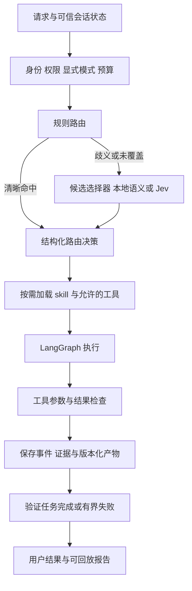

# 秋招优化：Harness、分层路由与 Jev 评估

> 后续实现更新（2026-09-26）：[Harness 落地与路由回归验证](09-Harness落地与路由回归验证.md) 已完成在线分块修复、版本发布事务、结构化路由、按需工具和执行预算，并提供默认关闭的 Jev 适配器。本文保留当时的分析与测试快照；其中旧问题状态、全量工具装载和测试数量以新实现报告为准。

> 2026-09-26。本次完成源码审查、官方资料调研和本地路由诊断。下文架构与验收门槛是建议，尚未接入 Jev、安装新框架或改变生产路由。Jev 按 TypeSafe AI 的结构化决策模型理解。

## 1. 面向秋招，接下来应证明什么

项目已有 MySQL/Qdrant/Redis、带权限检索、深度研究、12 个运行时 skill，以及写作辅助。继续优化的重点应是：**任务是否走对路径、执行是否有边界、失败能否恢复、效果是否有独立证据**。

建议形成三条可展示的主线：

1. **可信 RAG**：来源与权限、增量入库、版本替换、引用支持。
2. **科研任务执行**：通过受控工具完成实验分析和论文段落修改，保留输入、计算结果与作者确认。
3. **可评测的执行框架**：规则/语义/决策模型可替换，预算与工具约束独立于模型，失败轨迹可复现。

MySQL、Qdrant、Redis 是支撑这些行为的工程选择。面试材料应展示具体触发条件、改动、代价与实验结果，不以组件数量代替贡献。

## 2. 当前源码暴露的真实改进空间

| 现状 | 影响 | 建议优先级 |
|---|---|---|
| worker 调用不存在的 `get_chunker()`，版本归档发生在向量写入前 | 在线上传完整性尚不能保证；演示可能失败 | P0：先修闭环与验证 |
| `_quick_route()` 正则按顺序判断，只取最后一条用户消息 | 同义改写、引用中的算式、多轮指代可能误路由 | P1：结构化路由契约与诊断集 |
| Operation Agent 加载完整工具集合和科研 skill 全文 | 新 skill 越多，提示词越长，选择空间越大 | P1：按任务加载 skill 与工具 |
| Operation Agent 有总超时 180 秒，但未显式传入本项目的工具次数、模型轮数、token 预算策略 | 框架默认循环限制不等于业务预算控制 | P1：执行层统一预算 |
| 数据库 checkpointer、对话摘要和 Mem0 已存在 | 不等于每个外部操作都支持安全重放和幂等恢复 | P1：步骤事件、结果与产物记录 |
| 写作主要是聊天候选文本 | 缺少章节版本和证据绑定，无法完整演示作者接受修改 | P2：一个可回放的写作闭环 |
| 已有大量自动测试和历史评测 | 新 skill/路由场景未形成完整真实模型评测 | P1：按任务完成度评测 |

相关源码：[planner](../../src/agent/agents/planner.py)、[operation](../../src/agent/agents/operation.py)、[skill 注册表](../../src/agent/skills/registry.py)、[入库 worker](../../src/rag/ingestion/worker.py)。这些是本次核对的现状，不能把下面的建议提前写进简历当作已完成。

## 3. 先看本地路由诊断

本次对 `_quick_route()` 进行了不联网、不调用模型的诊断：12 条人工编写的样例，预热后重复 100 轮，共 1200 次计时。排除 Python 导入、模型、检索和 HTTP 开销：P50 **0.007006 ms**，P95 **0.015566 ms**。

按本次手工设定的分支标签，7/12 符合预期。刻意加入的五个问题如下：

| 请求 | 当前路由 | 期望或处理方向 |
|---|---|---|
| 算一下 1 GiB 相当于多少 MiB | 知识检索 | 单位工具 |
| 把这段改得更学术一些：Our method is fast. | 知识检索 | 写作 |
| 我之前提到的那段摘要，帮我润色 | 闲聊 | 写作；还需定位上一轮原文 |
| 论文里写了 2*3=6，这个结论有证据吗 | 工具 | 证据检索 |
| 介绍标准差在实验室评测规范里的要求 | 工具 | 规范检索 |

报告保存在本地 `.run/router-diagnostic-20260926.json`。这不是盲测集，也不能宣称当前真实准确率只有 58.3%。它证明了存在可重现缺陷，并说明**当前需要改善的是语义覆盖与决策质量，不是正则计算速度**。

可在面试中解释：路由组件更快不代表系统更快；错误路由可能多耗一次模型调用、造成用户重问，也可能导致整个任务失败。

## 4. Harness 在项目里如何落地

这里的 harness 指围绕模型的执行机制：输入状态、可用工具、上下文、预算、持久化、验证与停止条件。LangGraph 提供流程和状态基础；本项目需要在其上明确业务约束。LangSmith/Langfuse 是观测平台，不等于完整的执行 harness。

另一个概念是 evaluation harness：固定任务、环境快照、执行器和评分器，重复运行并比较版本。运行时与评测时应共享任务/事件契约，不能为评测单独实现一条更容易成功的业务路径。



### 4.1 最小模块划分（建议）

| 模块 | 契约 | 举例 |
|---|---|---|
| TaskSpec | task_id、用户/项目、任务类型、输入引用、完成条件、预算 | “润色 section X，保留数值与引用” |
| RouteDecision | handler、skills、provider、reason_code、原始概率、fallback_reason | 固定枚举，模型不能提供任意可执行代码 |
| CapabilityRegistry | 工具名、schema、权限、读写属性、超时、幂等策略 | 论文润色只装载写作与对比工具 |
| ContextBuilder | 正文/证据引用、版本、最近交互、token 预算 | 保留原文，摘要只作索引，不替代事实 |
| Executor | 总 deadline、模型轮数、工具调用预算、取消与恢复 | 检查每个步骤前剩余预算 |
| Verifier | 可确定性核验的完成条件，必要时模型审核与人工接受 | 表格数值、引用存在、修订版本匹配 |
| RunStore | 按顺序追加事件、输入摘要、工具结果引用、产物、错误类别 | 进程退出后识别已完成步骤 |

建议沿用现有 LangGraph，先补薄的一层应用契约，无需为了名称重写全部 Agent。`src/agent/harness/`、`src/agent/routing/` 可作为后续目录，但本次未创建空架构。

### 4.2 三个最有面试价值的机制

**按需加载技能。** 先用名称/描述选 skill，再加载所需的提示词和工具 schema。CSV 分析不需要论文回复规则；写作检查不需要所有 MCP 工具。多意图请求按声明的步骤组合能力，候选不足时允许回退，不能为了缩短提示词使工具不可达。

**预算和停止条件。** 对整个任务设 deadline，对每次模型/工具调用计数。提供者 SDK 的重试也计入同一预算；调用前做 token 上限估算，调用后记录实际 usage，不能宣称事后计数就是硬性预付费控制。同步线程超时不一定终止底层工作，写操作必须另有幂等键与最终状态检查。

**可恢复产物。** 论文写作保存原文版本、候选、diff、检查结果；入库保存 source/version、期望块清单、已写入块。恢复时重新校验权限和来源版本。checkpointer 不能自动给 MySQL/Qdrant 提供跨库 exactly-once，也不能让已经发生的外部写入自动回滚。

## 5. 参考哪些开源项目

| 来源 | 借鉴点 | 对本项目的取舍 |
|---|---|---|
| [LangChain Deep Agents](https://github.com/langchain-ai/deepagents) | 规划、上下文管理、skill 等 middleware 组合成 harness | 优先借鉴按需加载和上下文管理；保留现有有界图，不默认开启动态多 Agent |
| [Semantic Router](https://github.com/aurelio-labs/semantic-router) | 用语义表示匹配路由样例、优化阈值 | 作为可本地部署的对照；中文和多轮效果需要实测 |
| [LiteLLM Router](https://docs.litellm.ai/docs/routing) | 提供者层超时、重试、冷却与 fallback | 当前以百炼为主，可先借鉴机制；它主要做模型部署路由，不替代任务意图路由 |
| [JevRouter](https://github.com/BillionsBobby/JevRouter) | 结构化候选选择与执行权限分离、保留决策记录 | 可参考策略层设计；其公开路由实验不能直接当作本项目端到端收益 |
| [hyspacex/jev-router](https://github.com/hyspacex/jev-router) | 任务开始时绑定模型、保留可回放策略 | 属于早期模型路由项目，不是当前 Python 后端的直接替换件 |

[Anthropic 的长任务 harness 实践](https://www.anthropic.com/engineering/effective-harnesses-for-long-running-agents) 强调跨会话的状态和可交接产物，可映射为本项目的章节修订、实验结果和入库进度；不必照搬为无限自主运行的科研 Agent。

项目成熟度、API、依赖会变化；真正接入前锁定版本，检查许可证和本环境兼容性。研究某个机制不等于必须安装整个框架。

## 6. Jev 是什么，能否用起来

这里参考的是 [TypeSafe AI 的 Jev](https://typesafe.ai/blog/introducing-system-one-models-and-jev)，官方于 2026-09-15 宣布 early access。它侧重受限类型的决策，适合选择或评分；不能替代百炼生成论文段落。发布时间和速度描述属于官方发布信息，不是本项目测量。

官方文档的三种问题形式为 Choice（选项）、Score（按等级评分）、Noul（yes 概率）；Choice/Score 还有 probability distribution 和 confidence。[官方介绍](https://docs.typesafe.ai/introduction)

**类型受约束不等于语义正确，也不等于权限允许。** Confidence 是从预测分布派生的统计量，不应直接解读为“本次判断有 95% 概率正确”；是否允许自动采用，需要本项目数据校准。[Confidence 文档](https://docs.typesafe.ai/confidence)

### 6.1 最适合先试的三个位置

1. **规则未覆盖的任务/技能路由**：区分知识检索、用户材料润色、数值工具、闲聊，以及需澄清请求。
2. **候选 skill 的复核**：从注册描述中选择少量技能，缩短 Operation Agent 的工具和提示词输入；不要把用户可修改的描述当权限依据。
3. **检索后证据相关性或引用支持的辅助筛查**：后续独立实验，保留原文与失败回退；不直接删除当前 ACL 或让模型独立决定可访问资料。

先只试第一个位置，避免一次增加路由、重排、审核三个外部调用，导致无法归因。Jev 不负责计算百分比、检查数据库权限、确定已完成写入或批准预算超限。

### 6.2 官方接入路径与环境条件

核对的官方 [quickstart](https://docs.typesafe.ai/introduction/quickstart) 使用 Python 包 `typesafe-sdk`、模块 `typesafe_sdk` 和环境变量 `TYPESAFE_API_KEY`；REST 接口是 `https://api.typesafe.ai/v1/systemone`，客户端提交 state 与 questions。可参考 [官方 Python SDK](https://github.com/typesafe-ai/typesafe-sdk-python)。

SDK 和社区路由器开源，不代表 Jev 模型权重已开放或可用 Docker 本地推理。本次未找到并验证可下载权重，不按离线模型规划。百炼充值也不提供 Jev 的凭据或额度，需要单独具备服务访问条件。

服务器只能通过代理访问外网，需在实际后端进程中验证连接、TLS、超时和并发，不把网页可访问视作认证推理成功。云端只发送路由需要的最小用户意图/可信上下文，避免把整篇未发表论文送过去；必要时选择本地语义路由。

本次读取了官方资料，但没有调用 Jev 认证推理接口，没有产生 Jev 延迟、费用或准确率结果。不要照抄社区站点的域名/API 路径，凭据仅交给核验过的服务端点。

## 7. 建议采用分层路由，而不是全部替换

```text
0. 服务端身份、允许能力、显式 normal/deep 模式
1. 高精度本地规则：问候、清晰计算、明确任务入口
2. 歧义输入：可替换的本地语义选择器或 Jev
3. 代码检查候选集合、置信门槛、冲突、剩余预算
4. 低置信 / timeout / invalid：既有检索回退或询问用户
5. 输出 RouteDecision，记录采用了谁的结果与原因
```

`deep` 仍由用户显式开启；模型不能通过把请求判为“复杂”就自行增加成本。权限由工具与服务层重新验证，即使路由把任务判对也不跳过权限检查。

当前 `_quick_route()` 总会返回分支，没有“未命中”信号。接入前需拆分 `matched_rule` 与 `default_fallback`，否则无法只将歧义请求交给 Jev，容易无意变成全量调用。此前出现误路由的宽泛关键词规则也不能都当成高置信规则直通。

建议内部决策字段（不是 Jev 原始 HTTP 格式）：

```json
{
  "handler": "operation_agent",
  "skills": ["paper_writing", "text_analysis"],
  "provider": "jev",
  "reason_code": "rewrite_supplied_material",
  "model_version": "<实际返回版本>",
  "policy_version": "routing-v1",
  "confidence": null,
  "probabilities": {},
  "fallback_reason": null
}
```

人工规则的 confidence 可以为空，不能伪造成模型概率。Jev 原始概率保留用于评估，记录 top-1、top-2 间隔与是否拒绝决策；阈值在开发集上选择，并在独立测试集报告覆盖率/错误率，不随便拍一个 0.8 当通用标准。

路由缓存键至少含规范化输入、最近相关轮次/当前任务类型、可用能力集合、模型版本、策略版本。涉及权限候选时还需用户/项目作用域和权限版本；不能只用最后一句“继续”当全局缓存键。每次执行仍检查权限。

## 8. 怎样证明 Jev 值得接入

先建立至少覆盖以下类别的任务集：知识问答、数值工具、写作/翻译、闲聊、缺输入、复合任务、多轮指代、引用中含关键词/代码、越权诱导。建议首轮约 200–300 条，但更重要的是独立标注和场景覆盖，不是数量本身。

| 对照组 | 目的 |
|---|---|
| A：当前规则 | 保留现有基线与已知失败 |
| B：改进规则 + 按需 skill | 测量不增加外部模型的收益 |
| C：规则 + 本地语义路由 | 检查受限网络下的替代方案 |
| D：规则 + Jev | 测量增量覆盖和新增延迟/费用 |
| E：小型百炼模型分类（可选） | 对比生成模型与决策模型，不让提供者宣传替代对照 |

调参与最终测试按语义模板/任务族拆分，避免同一句换几个词同时出现在两边。需要上下文的 case 包含最近轮次、当前任务与期望允许工具，不能只评估一条孤立字符串。

路由层报告 macro-F1、各类召回率、fallback/abstain 覆盖率、被自动采用部分的错误率、需要时的 ECE/Brier；无法拿到概率的规则组不编造校准分数。若多个路径都合理，可标允许集合与最终任务要求。

任务层报告完成率、错误工具调用率、ACL violation、P50/P95 全链路延迟、模型调用量、实际 usage/费用。将冷启动、缓存未命中和命中分开；固定模型版本与输入材料。不能拿本地正则的微秒延迟与另一个项目的远程全任务秒数作速度比。

上线步骤建议 `off → 离线评估 → 脱敏 shadow → 有界启用`。Shadow 只记录候选决策，不执行第二次业务任务，但会产生外部调用成本与数据传输，仍需控制输入和预算。故障开关应能立即回到规则与现有业务路径。

## 9. 秋招导向实施顺序

| 顺序 | 可交付结果 | 面试时能够解释的工程问题 |
|---|---|---|
| 1 | 上传—解析—写入—检索端到端用例；修复分块接口与版本发布顺序 | 为什么 mock 测试通过仍会真实入库失败 |
| 2 | TaskSpec/RouteDecision、按需技能、工具预算、统一事件 | 怎样把模型的自由选择限制在业务允许范围内 |
| 3 | 独立路由集、可替换选择器、Jev 离线或 shadow 报告 | 如何权衡准确率、覆盖率、延迟、成本 |
| 4 | 一个完整论文任务：数据 → 表格 → 段落 → 检查 → 接受版本 | 模型生成如何关联真实证据和确定性计算 |
| 5 | 故障注入与恢复：Redis 断开、模型 429、工具超时、进程中断 | 重试、幂等、降级、恢复与跨库边界 |

优先完成 1–3，再扩大写作界面。已有 460 项通过的测试是代码回归快照，不是实际模型任务成功率；引用之前的历史多 Agent 指标时保留数据集与版本，不用旧结果证明新增功能。

## 10. 面试表述模板

实现并验证后可以这样讲，括号里的指标必须用实测值填写：

> 我负责的是带权限和证据追溯的科研助手。随着技能增加，纯关键词路由开始误判多轮写作和引用核查请求。我保留本地规则处理清晰意图，把歧义决策做成可替换接口，并比较本地语义模型和 Jev。在执行层统一了能力白名单、调用预算、版本化产物和失败恢复。最终用独立任务集衡量路由质量和端到端完成率，记录延迟、成本以及回退比例，而不是只看模型单次判断速度。

本次已经完成的是设计与小型规则诊断。Harness 重构、Jev 模型接入和独立评估仍待实施，不应在简历里使用“已上线”“提升 XX%”等表述。
