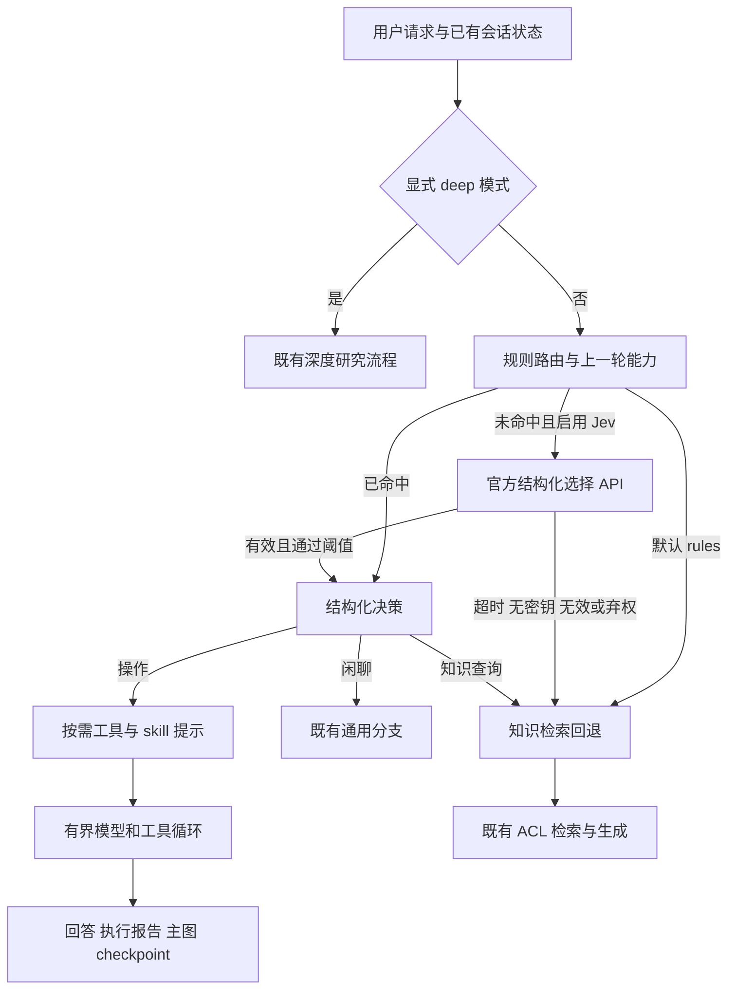

# Harness 落地与路由回归验证

> 2026-09-26。本文记录已实现代码和本次验证，承接 [08 设计评估](08-秋招优化与Harness及Jev路由评估.md)。开发环境为 `agent-demo`。未重启现有后端、未重灌生产知识库；已有进程需要在正常部署时重启才能使用新代码。Jev 默认关闭，未进行真实服务评测。

## 1. 本次 Goal 与验收结果

**目标：把科研助手的路由、工具执行与在线入库变成可测试、可限制、失败可回退的执行链路，提供面试可复现证据。**

| 验收项 | 实现与证据 |
|---|---|
| 在线入库真正分块 | Worker 与批量脚本共用 1200 字符 / 150 重叠的分块器；真实文本解析到内存 Qdrant 的联测通过 |
| 版本发布不抢跑 | 新向量写入、ID 返回与回查验证完成后发布元数据，随后删除旧块；失败注入与重试通过 |
| 元数据事务一致 | MySQL 同文档命名锁 + 插入和替代同一事务；SQLite 测试路径使用 `BEGIN IMMEDIATE` |
| 路由可解释 | 记录 handler、skills、rule_id、policy_version、provider 与 fallback_reason |
| 按任务装载能力 | 路由只选择代码白名单中的 skill，模型只能调用本轮装载的工具 |
| 执行有界 | 模型次数、工具次数、总时限、工具时限、输入与输出字符数、单次模型输出 token 上限 |
| 故障可诊断 | run_id、计数、事件顺序、耗时、工具结果 hash；主图 checkpoint 保存节点结束后的报告 |
| Jev 可选与可退 | 官方 REST 适配、响应契约校验、低置信度弃权、1.5 秒默认超时、10 秒进程内熔断 |
| 评测可复现 | 50 条自编回归样例、原始 JSON 报告、输入与源码 SHA-256、Git HEAD 和 dirty 标记 |

这是首版业务 harness。没有引入独立调度平台、容器执行沙箱或新的数据库。

## 2. 请求如何运行



路由策略先识别需要证据或内部规范的请求，避免把“论文里写了 2*3=6，这个结论有证据吗”当成算术题。写作意图先于个人会话回忆，避免把“我之前提到的摘要，帮我润色”分到闲聊。多数操作意图只匹配冒号或换行前的指令，以减少粘贴正文中的关键词干扰。这是启发式规则，不是任意提示注入的安全证明。

“继续”等明确续接语句可沿用上一轮 operation 的已允许 skill。原文仍依赖会话消息；如果没有原文，助手应要求补充，不能凭空恢复。没有有效上一轮能力时回退知识分支。deep 模式仍由用户显式选择，Jev 不决定升级深度研究，也不授予身份或检索权限。

新增主要实现：

- [policy.py](../../src/agent/routing/policy.py)：结构化决策与本地规则。
- [jev.py](../../src/agent/routing/jev.py)：TypeSafe API 适配与回退。
- [runtime.py](../../src/agent/harness/runtime.py)：有界执行循环。
- [operation.py](../../src/agent/agents/operation.py)：按任务创建模型工具绑定，返回执行报告。
- [registry.py](../../src/agent/skills/registry.py)：可装载 skill 白名单与对应提示词。

## 3. 工具装载与执行预算

此前本地 registry 含 20 个工具，操作分支装载科研 skill 的完整提示。现在只装载本轮所需能力。下面只统计本地工具和 system prompt 字符，**不包含 MCP、会话历史、用户身份和工具 schema，也不是实际 token 或费用统计**。

| 场景 | 本地工具数 | System prompt 字符 |
|---|---:|---:|
| 旧本地全集基线 | 20 | 3408 |
| 算术 `17*23` 所属能力 | 1 | 682 |
| CSV 分析 | 2 | 869 |
| 写作 / 审稿回复 | 8 | 2159 |

原始计数见 [selected-skills-v1.json](evidence/selected-skills-v1.json)。这些结果证明候选工具和提示文本减少，尚不能声称模型选工具正确率、最终质量、费用或端到端延迟已经改善。写作装载 8 个候选工具，默认最多执行 6 次调用；候选数和调用预算是不同概念。

默认 operation 预算如下，详见 [配置模板](../../config/env.template)：

| 配置 | 默认值 | 执行含义 |
|---|---:|---|
| `OPERATION_MAX_MODEL_CALLS` | 4 | 一次 operation 节点的模型调用次数；该节点关闭 SDK 自动重试 |
| `OPERATION_MAX_TOOL_CALLS` | 6 | 累计工具调用次数；先检查整批是否越界 |
| `OPERATION_DEADLINE_SECONDS` | 90 | 一次 operation 的时限 |
| `OPERATION_TOOL_TIMEOUT_SECONDS` | 15 | 单次工具等待上限，同时受剩余总时间约束 |
| `OPERATION_MAX_INPUT_CHARS` | 60000 | 每轮累计消息正文和工具调用参数大小；超出明确停止，不静默删原文 |
| `OPERATION_MAX_OUTPUT_CHARS` | 16000 | 单条最终回答或工具结果字符上限 |
| `OPERATION_MAX_OUTPUT_TOKENS` | 2000 | 传给模型的每次输出 token 上限 |

执行器先校验整批工具名、调用 ID 和参数 schema，全部通过后才顺序执行，防止第一项已执行而第二项才发现越权。未知工具、重复 ID、畸形参数直接停止；工具返回 `{"ok":false}` 时保留错误交给下一轮模型处理，同时记录 `tool_failed`。最终回答生成成功不代表所有工具都成功，也不等于业务质量已经验收。

工具结果事件只保存名称、长度与 SHA-256，不复制正文或参数。**主图会话状态仍包含正常对话内容；事件脱敏不代表数据库全部无敏感信息。** 模型 usage 有返回时汇总 token，用于观测；当前没有跨节点统一费用预算，也没有把 token 精确计费当成硬约束。

当前允许能力是本地无外部写入工具，包括读取当前时间。Python 异步超时只能取消等待，不能强制终止正在执行的同步线程；计算器另外采用受限 AST、表达式长度、节点数和指数上限，取消原来的 `eval`。以后加入文件写入、邮件、远程命令等能力，需要独立的权限、幂等和执行隔离设计，不能直接加入白名单。

技能发现不再调用普通零参数函数来猜测它是不是工厂；只有 YAML 显式声明 `factory: true` 才执行工厂。Skill 文件属于可信部署代码，运行时不会接收用户上传的插件代码。

## 4. 入库、版本事务与恢复边界

在线 Worker 的新顺序：

```text
真实 loader 解析
→ 共享递归字符 splitter，去掉空块，零块报错
→ 检查版本冲突
→ 合并服务端来源与 ACL 元数据，生成稳定 chunk ID
→ 获取同来源旧 ID，写入新块
→ 检查返回 ID 集合，再按来源回查新 ID 完整性
→ MySQL 发布新版本、旧版本标 superseded（同一事务）
→ 删除不属于新集合的旧块
→ 任务完成
```

[共享分块器](../../src/rag/processing/ingestion_splitter.py) 保留原批量策略：`1200/150` **按字符而非 token**，分隔符顺序为段落、换行、句号、分号、空格、字符。PDF 的页边界仍由 loader 决定；分块不会自动跨页合并。在线 chunk 附加 `split1200-overlap150-v1` 签名。`CHUNK_TOKEN_SIZE` 等配置属于其他可选 loader 策略，不控制这条链路。

版本 ID 由 job_id 派生稳定 UUID，任务重试不重复插入版本。[publish_version](../../src/rag/storage/version_manager.py) 修复了此前“插入后再查当前版本，可能把新版本自己标成 superseded”的问题。MySQL 的同文档命名锁覆盖首次发布和后续发布，事务内再次检查版本顺序；较旧版本不能覆盖较新版本，已被替代的任务不能重新激活旧版本。

| 故障位置 | 已验证行为 |
|---|---|
| 无文本 / 空上传 | 任务失败，旧版本保持 active |
| embedding 失败 | 旧向量和旧版本不删除 |
| 只返回部分 ID / 回查发现新块缺失 | 不发布新版本，不删除旧块 |
| 元数据替代更新失败 | 同一 SQL 事务回滚，新插入版本也不保留 |
| 发布成功、删除旧块失败 | 任务失败但新版本已经 active；重试复用版本 ID 并继续清理 |
| 同文档并发发布 | MySQL 联测确认最终只有一个 active，低版本不覆盖高版本 |

**这仍不是 MySQL 和 Qdrant 的分布式原子事务。** 部分新块写入后失败、发布失败或旧块清理失败时，新旧 payload 可能暂时共存，但检索默认只看 active，staging/retired 不参与普通回答。元数据锁只保护版本发布，不保护整段跨库向量替换；同来源并发写入、同版本但不同内容、检索与发布交错，仍需要 outbox/补偿任务和来源级协调进一步治理。

当前验证覆盖单任务安全替换、重试和元数据并发；不能宣传成“跨库强一致”“任务 exactly-once”或“任意时刻只能检索当前版本”。其他旧同步入库入口也不能自动获得 Worker 的全部保证。实际 MySQL 测试使用 `eka_verify_*` 隔离 schema，Qdrant 联测使用内存实例和固定假 embedding，没有覆盖线上 Qdrant 故障或百炼 embedding 质量。

## 5. Jev 怎样启用，失败时怎么办

实现依据 TypeSafe 的 [官方快速开始](https://docs.typesafe.ai/introduction/quickstart) 和 [Jev 发布说明](https://typesafe.ai/blog/introducing-system-one-models-and-jev)。使用已存在的 `httpx` 调用 `POST https://api.typesafe.ai/v1/systemone`，请求提供 `state`、`questions.route.type=choice` 和代码定义的候选 criteria，Bearer 密钥独立于百炼。

默认 `ROUTING_PROVIDER=rules`，不会发 Jev 请求。需要试验时在运行环境设置：

```dotenv
ROUTING_PROVIDER=jev
TYPESAFE_API_KEY=<单独申请的 TypeSafe 密钥>
JEV_MODEL=jev-latest
JEV_TIMEOUT_SECONDS=1.5
JEV_MIN_CONFIDENCE=0.8
JEV_MIN_MARGIN=0.15
```

先 `set_proxy` 再从该环境启动后端，前提是这条 shell 命令确实导出了 HTTP(S) 代理环境变量；已有后台进程不会自动获得新环境。httpx 使用环境代理，Docker 守护进程代理配置不等于应用进程代理。这里不下载 Jev 镜像，也不把 TypeSafe SDK 开源等同于模型权重开放。

本次本地没有 TypeSafe 密钥，保持 rules 默认值。百炼用于回答的模型配置不变；给百炼充值不能替代 TypeSafe 凭据。

Jev 只处理规则未命中的请求。发送当前请求最多 4000 字符及最近两条用户请求，每条由 planner 限制为 1000 字符；未发送整个知识库、完整系统提示或完整会话。返回值必须是候选集合中的 choice、合法数值 confidence、完整概率分布，以及模型版本。低 confidence、前两项概率差过小或 `uncertain` 均弃权。

`0.8/0.15` 是**未经真实数据校准的初始阈值**；confidence 不能直接解释成正确概率。`jev-latest` 也不是固定模型版本，报告保存响应版本，后续对比应尽量固定可用模型版本。没有真实 Jev 样本，所以不能报告其准确率、P95、成本优势或比本地规则更快。

缺少密钥直接回退；HTTP 错误、超时或无效结构回退并打开 10 秒进程内熔断。默认只尝试一次，随后走已有带 ACL 的知识路径。回退不保证猜中用户意图，只保证外部决策服务故障不会直接中断主路由。Jev 输出仅映射到固定能力，不构造可执行代码。

## 6. 本次验证与复现

```bash
conda run -n agent-demo python -m pytest -q
RUN_MYSQL_TESTS=1 conda run -n agent-demo python -m pytest tests/test_storage_upgrade.py -q
conda run -n agent-demo python scripts/evaluate_research_routing.py
```

- 全量：**502 passed、5 skipped**；5 个默认跳过项是需显式开启的 MySQL 测试。
- 本地 Docker MySQL 存储组：**13 passed**，包含上述 5 个集成测试。
- 警告为现有依赖弃用提醒和内存 Qdrant 不构建服务端 payload 索引提示，未被当作服务端索引性能证据。

新增测试：[执行预算与 checkpoint](../../tests/test_harness_runtime.py)、[路由与 Jev 故障](../../tests/test_routing_harness.py)、[入库失败恢复](../../tests/test_ingestion_harness.py)、[MySQL 存储契约](../../tests/test_storage_upgrade.py)。模型执行测试使用脚本化 AIMessage 和真实 LangChain 工具调用协议；Jev 使用 `httpx.MockTransport`，都不调用付费模型。

[路由数据集](../../tests/eval/fixtures/research_routing_v1.jsonl) 含旧诊断 12 条和新增自编验收 38 条。固定标签下 handler 与要求的 skill 验收全部通过：**50/50，macro-F1=1.0**。原 12 条诊断从 **7/12** 到 **12/12**。这是针对已知缺陷的回归结果，**不是独立盲测，不等于真实任务准确率 100%**，也没有评估最终写作质量。

[原始报告](evidence/research-routing-v1.json) 记录 5000 次预热后规则函数调用：P50 **0.009739 ms**、P95 **0.013040 ms**，排除 import、HTTP、模型、检索和整段业务处理。与旧快照的微秒级差异没有端到端性能意义，优化价值首先是正确分支和能力控制。

报告保存源码与 fixture hash。重新运行可复现分类结果，耗时随设备负载变化。测试中的脚本化模型可以重放固定工具序列并复核状态转换；当前没有持久化每一步工具正文的独立 RunStore，也不支持进程崩溃后从任意工具中间点恢复。主图 checkpoint 在节点结束时保存报告，进程在节点内部崩溃可能丢失本轮事件。

## 7. 面试怎么讲

**一分钟版本：**

> 我的科研助手已有 MySQL、Qdrant 和 Redis，但我发现组件齐全不代表任务链路可靠。第一步修复在线上传的分块接口，让它复用批量入库的 1200/150 字符策略，并把发布版本放到新向量验证之后。元数据发布通过 SQL 事务和同文档锁保证一致，任务 ID 派生版本 ID 支持重试，但我明确区分它与跨库原子性。
>
> 第二步在 LangGraph 上实现业务 harness：路由产生结构化能力选择，按任务装载工具，模型调用和工具执行都受预算约束，运行事件随主图状态保存。算术任务候选工具从本地全集 20 个缩到 1 个。Jev 做成默认关闭的候选决策适配器，故障时回退。
>
> 我用故障注入、真实 MySQL 并发测试和固定回归集验证行为。50 条自编样例全通过只证明回归验收，不能替代独立真实用户评测。下一步应补盲测、真实模型任务完成率和跨库发布隔离，而不是直接声称框架让准确率提升了多少。

**常见追问：**

| 追问 | 回答要点 |
|---|---|
| Harness 和 Agent 有何区别？ | Agent 决定下一步；执行器决定哪些动作允许执行、最多执行多少、如何验证和停止。提示词要求不能代替代码边界。 |
| 为什么继续用 LangGraph？ | 保留主图路由、会话状态和 checkpoint；在 operation 内显式实现预算和工具协议，无需重新迁移主流程。 |
| 为何不用 Jev 替代所有规则？ | 本地规则已是微秒级，已知明确场景无需网络；Jev 的潜在价值是覆盖语义，不是替代廉价确定性判断。 |
| 工具 schema 校验足够安全吗？ | 只能保证结构，业务边界由各工具验证；身份、ACL、外部副作用授权不能由模型参数授予。 |
| 50/50 可以写简历吗？ | 可写“50 条回归用例通过”，不能写“路由准确率达到 100%”；应另设独立采样数据和最终任务指标。 |
| 最大剩余风险？ | 跨库发布仍非分布式事务，补偿任务尚未落地；同步线程无法硬终止、节点中间事件非持久化，以及尚无真实 Jev 效果证据。 |

## 8. Jev 暂停后的继续优化

本轮暂不启用 TypeSafe/Jev，规则路由仍是默认实现。继续优化集中在不依赖外部路由服务的可靠性：

### 8.1 入库采用 staging → active → retired

在线更新生成的新 chunks 会带 `ingestion_state=staging` 和稳定的 `ingestion_version_id`。检索过滤器默认只允许 `active`，同时兼容历史数据中没有 `ingestion_state` 的 chunks。新向量、版本元数据和来源回查都成功后，版本记录发布，再把新代切换为 active；旧代在物理删除前先设为 retired。

这解决了一个实际窗口：如果新向量已经写入但 MySQL 发布失败，或者进程在发布后、清理前崩溃，残留的新代不会被普通检索直接看到；旧代也不会继续作为“当前版本”与新代混合返回。重试使用相同 job 派生的版本 ID，发布操作幂等，之后可以继续激活和清理。

这仍然不是跨库事务。MySQL 版本行和 Qdrant payload 更新之间可能短暂不一致；如果服务永久中断，需要补偿任务扫描 staging/retired 代。下一步可以增加 `ingestion_reconciliation` 表或 outbox，记录 `prepared/published/activated/cleaned` 状态并定期修复，而不是依赖人工重试。

### 8.2 Redis 增加 single-flight

embedding 冷缓存请求增加进程内 single-flight：同一批次的并发请求只允许一个线程访问百炼或本地模型，其余请求等待结果并再次读取缓存。缓存不可用时仍回退到原计算路径，不把 Redis 变成正确性依赖。缓存 key 继续包含模型、版本、用途和完整输入，避免 query/document 或不同模型串用。

当前 single-flight 是**进程内**保护；多副本部署时仍会发生跨进程重复计算。若以后 API 成本或本地 GPU 压力足够高，再用 Redis `SET NX PX` 加 token 校验实现跨进程锁，并设置锁超时和 owner 释放，避免死锁。不能用简单的 `DEL` 释放别人的锁。

### 8.3 检索指标进入主图状态

检索节点现在产生隐私保护的 `retrieval_metrics`：查询 SHA-256、总耗时、结果数、重写次数、CRAG decision、平均分、状态和异常类型。保存查询摘要而不是原文，前端/研究运行指标可继续携带这些字段。它能回答“慢在哪一步、返回了几篇、是否触发重写”，但不等于质量指标；Recall、MRR 和引用正确率仍需固定标注集计算。

建议后续按下面顺序继续：

1. 增加 outbox/reconciliation，定期处理 staging 超时、active 但未激活和 retired 未删除代。
2. 给查询、embedding、rerank 和生成分别记录 trace id，接入现有日志或 LangSmith/Langfuse；外部平台只负责观测，不能代替 ACL 和执行边界。
3. 构造独立时间切分的检索盲测集，报告 Recall@k、MRR、ACL violation、P95 延迟和缓存命中率。
4. 再评估 Jev：固定模型版本、收集真实路由样本、校准 confidence 阈值，并与规则回退做 paired 对照。

## 9. 小范围检索修复（2026-09-26）

本轮只修复一个明确缺陷：`RetrieverManager` 的混合检索入口此前没有把 `base_filter` 传给 Hybrid manager，导致直接调用 `search()` 时可能忽略项目或文档类型条件；部分带分数路径虽然做了结果层过滤，但行为不一致。

现在普通向量、混合向量和 BM25 路径统一接收同一个过滤条件。向量检索在候选阶段过滤，BM25 在融合前过滤，最终结果再做一次轻量校验。没有新增服务、队列或外部依赖，新增两条回归测试覆盖入口参数传递和 BM25 结果过滤。

## 10. 直接文本写入统一分块（2026-09-26）

继续核对入口时发现，文件异步入库已经使用共享分块器，但 `KnowledgeService.add_document()` 仍会把用户直接粘贴的长文本作为一个向量写入。现在该入口也复用同一套 1200 字符 / 150 重叠分块，并附加 `split1200-overlap150-v1` 签名。短文本行为不变，长文本不再绕过分块策略。

这只是入口统一，不增加新的存储或任务系统；长文本回归测试验证了 chunk 长度和签名。
